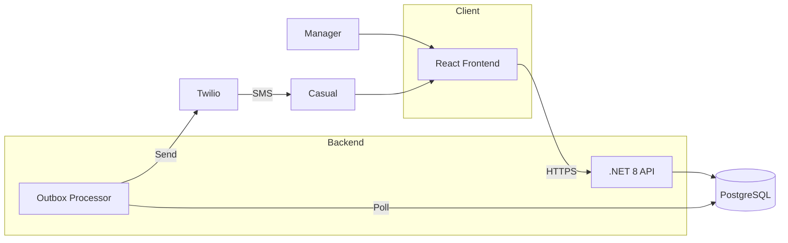
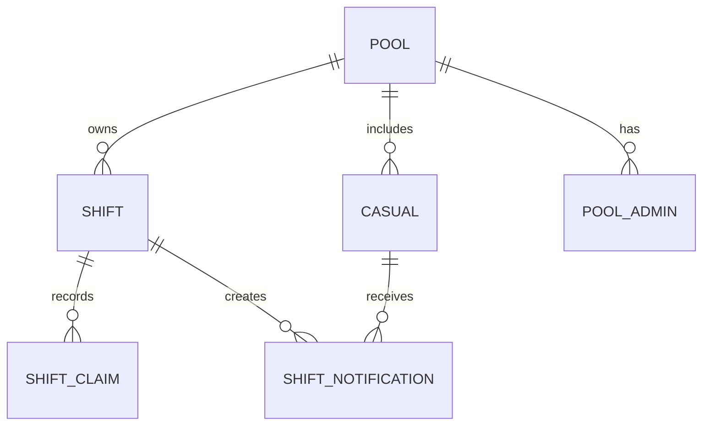

# ShiftDrop

**Fill last-minute shifts without the chaos.**

Someone calls in sick. Now you're texting everyone, tracking who replied, who's available, who left you on read. It takes forever.

ShiftDrop makes it simple: post a shift, your team gets an SMS, first to respond claims it. Fair, transparent, and no one gets forgotten.

**Live:** [shiftdrop-app.vercel.app](https://shiftdrop-app.vercel.app)

---

## How it works

1. **Post a shift** — Pick a time, set how many people you need
2. **Team gets notified** — Everyone on your roster gets an SMS with a link
3. **Shift gets filled** — First to respond gets the spot

No app downloads for staff. Just SMS links that work.

---

## The stack

| Layer | Tech |
|-------|------|
| **Frontend** | React 19 + Vite + Tailwind v4 |
| **Backend** | .NET 8 Minimal API, vertical slices |
| **Database** | PostgreSQL |
| **Auth** | Auth0 (managers) / SMS tokens (casuals) |
| **SMS** | Twilio via outbox pattern |
| **Hosting** | Vercel (frontend) + Railway (backend) |

---

## Architecture



### Why the outbox pattern?

Sending SMS directly after `SaveChanges()` can cause issues — if Twilio fails after your DB commits, data gets out of sync. The outbox queues messages in the same transaction, then a background processor sends them. Reliable delivery, nothing gets lost.

### Domain model



- **Pool** — A manager's group of casuals
- **Shift** — Has spots. Uses concurrency tokens to handle race conditions.
- **Casual** — Worker identified by phone. No account needed.
- **Pool Admin (2IC)** — Delegated managers who can post shifts

---

## Run it locally

### Backend
```bash
dotnet build
dotnet run # http://localhost:5228
```

### Frontend
```bash
cd frontend
npm install
npm run dev # http://localhost:3000
```

Without `VITE_API_URL`, frontend uses an in-memory mock API. Good for hacking on UI.

---

## Configuration

### Backend (env vars or `appsettings.json`)

```
ConnectionStrings__DefaultConnection=Host=...;Database=...
Auth0__Authority=https://your-tenant.auth0.com/
Auth0__Audience=https://your-api
App__BaseUrl=https://your-frontend.com
Twilio__AccountSid=...
Twilio__AuthToken=...
Twilio__FromNumber=+1234567890
```

### Frontend (`frontend/.env.local`)

```
VITE_API_URL=http://localhost:5228
VITE_AUTH0_DOMAIN=your-tenant.auth0.com
VITE_AUTH0_CLIENT_ID=your-client-id
VITE_AUTH0_AUDIENCE=https://your-api
```

---

## Deploy

**Frontend:** `cd frontend && vercel --prod`

**Backend:** `railway up`

**Database:** Run migrations: `dotnet ef database update --connection "your-connection-string"`

---

## Tests

```bash
dotnet test             # Backend
cd frontend && npm test # Frontend
```

---

## Key decisions

- **Vertical slices** — Each feature is a folder, not scattered across layers
- **Result\<T\>** — No exceptions for control flow. Errors are explicit.
- **Concurrency tokens** — Two casuals claim the last spot simultaneously? One wins, one gets a clean error.
- **SMS-first for casuals** — No app, no friction. Click the link, claim the shift.
- **Outbox for reliability** — SMS delivery survives crashes

---

## License

MIT. Do whatever you want with it.
