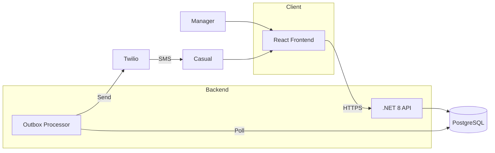
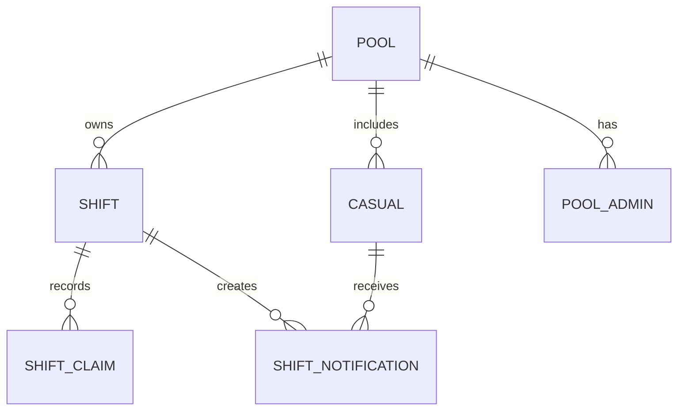

# ShiftDrop

**Kill the group chat. Fill shifts in seconds.**

You know the drill. Someone calls in sick. Now you're texting 15 people, tracking who replied, who's available, who left you on read. By the time you've filled the shift, you've burned 45 minutes and your sanity.

ShiftDrop fixes this. Post a shift → SMS goes to your whole casual pool → first to claim wins. Done.

**Live:** [shiftdrop-app.vercel.app](https://shiftdrop-app.vercel.app)

---

## How it works

1. **Manager posts a shift** — "Tomorrow 9am-2pm, need 2 people"
2. **SMS blasts out** — Every active casual gets a link
3. **Casuals claim spots** — First-come, first-served. Fair and fast.
4. **Shift fills itself** — You get on with your life

No app downloads. No accounts for casuals. Just SMS links that work.

---

## The stack

| Layer | Tech |
|-------|------|
| **Frontend** | React 19 + Vite + Tailwind v4 |
| **Backend** | .NET 8 Minimal API, vertical slices |
| **Database** | PostgreSQL |
| **Auth** | Auth0 (managers) / SMS tokens (casuals) |
| **SMS** | Twilio via outbox pattern |
| **Hosting** | Vercel (frontend) + Railway (backend) |

---

## Architecture



### Why the outbox pattern?

Direct SMS after `SaveChanges()` = dual-write bug. If Twilio fails after your DB commits, you're screwed. The outbox queues SMS in the same transaction, then a background processor sends them. Reliable delivery, no tears.

### Domain model



- **Pool** — A manager's group of casuals
- **Shift** — Has spots. Uses concurrency tokens to handle race conditions.
- **Casual** — Worker identified by phone. No account needed.
- **Pool Admin (2IC)** — Delegated managers who can post shifts

---

## Run it locally

### Backend
```bash
dotnet build
dotnet run # http://localhost:5228
```

### Frontend
```bash
cd frontend
npm install
npm run dev # http://localhost:3000
```

Without `VITE_API_URL`, frontend uses an in-memory mock API. Good for hacking on UI.

---

## Configuration

### Backend (env vars or `appsettings.json`)

```
ConnectionStrings__DefaultConnection=Host=...;Database=...
Auth0__Authority=https://your-tenant.auth0.com/
Auth0__Audience=https://your-api
App__BaseUrl=https://your-frontend.com
Twilio__AccountSid=...
Twilio__AuthToken=...
Twilio__FromNumber=+1234567890
```

### Frontend (`frontend/.env.local`)

```
VITE_API_URL=http://localhost:5228
VITE_AUTH0_DOMAIN=your-tenant.auth0.com
VITE_AUTH0_CLIENT_ID=your-client-id
VITE_AUTH0_AUDIENCE=https://your-api
```

---

## Deploy

**Frontend:** `cd frontend && vercel --prod`

**Backend:** `railway up`

**Database:** Run migrations: `dotnet ef database update --connection "your-connection-string"`

---

## Tests

```bash
dotnet test             # Backend
cd frontend && npm test # Frontend
```

---

## Key decisions

- **Vertical slices** — Each feature is a folder, not scattered across layers
- **Result\<T\>** — No exceptions for control flow. Errors are explicit.
- **Concurrency tokens** — Two casuals claim the last spot simultaneously? One wins, one gets a clean error.
- **SMS-first for casuals** — No app, no friction. Click the link, claim the shift.
- **Outbox for reliability** — SMS delivery survives crashes

---

## License

MIT. Do whatever you want with it.
