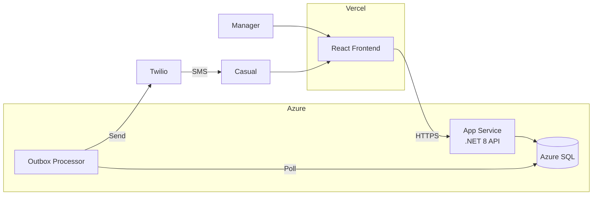
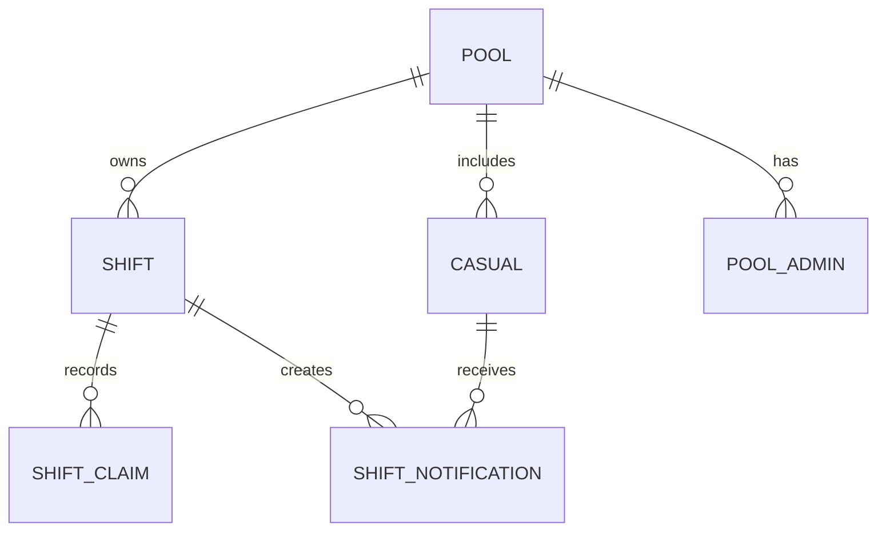

# ShiftDrop

[](https://github.com/NathanDrake2406/ShiftDrop/actions/workflows/ci-cd.yml)
[](https://dotnet.microsoft.com/)
[](https://react.dev/)
[](https://opensource.org/licenses/MIT)

**Fill last-minute shifts without the chaos.**

Someone calls in sick. Now you're texting everyone, tracking who replied, who's available, who left you on read. It takes forever.

ShiftDrop makes it simple: post a shift, your team gets an SMS, first to respond claims it. Fair, transparent, and no one gets forgotten.

**Live Demo:** [shift-drop.vercel.app](https://shift-drop.vercel.app)

---

## How it works

1. **Post a shift** — Pick a time, set how many people you need
2. **Team gets notified** — Everyone on your roster gets an SMS with a link
3. **Shift gets filled** — First to respond gets the spot

No app downloads for staff. Just SMS links that work.

---

## Tech Stack

| Layer | Tech |
|-------|------|
| **Frontend** | React 19 + TypeScript + Vite + Tailwind v4 |
| **Backend** | .NET 8 Minimal API, Vertical Slice Architecture |
| **Database** | Azure SQL Database with EF Core |
| **Auth** | Auth0 (managers) / SMS tokens (casuals) |
| **SMS** | Twilio via transactional outbox pattern |
| **Logging** | Serilog with structured JSON output |
| **Hosting** | Vercel (frontend) + Azure App Service (backend) |
| **CI/CD** | GitHub Actions with automated Azure deployment |

---

## Architecture



### Key Architectural Decisions

| Decision | Why |
|----------|-----|
| **Vertical slices** | Each feature is self-contained in one folder, not scattered across layers |
| **Result\<T\>** | Explicit error handling. No exceptions for control flow. |
| **Outbox pattern** | SMS delivery survives crashes. Messages queued in same DB transaction. |
| **Concurrency tokens** | Two casuals claim the last spot? One wins, one gets a clean 409 error. |
| **SMS-first for casuals** | No app download, no account creation. Click link, claim shift. |
| **Multi-tenancy** | Pools isolate data. Tests verify no cross-tenant leakage. |
| **Authorization-transparent 404s** | Unauthorized cross-tenant access returns 404, not 403. Prevents resource enumeration. |

### Domain Model



- **Pool** — A manager's group of casuals (tenant boundary)
- **Shift** — Has spots. Uses EF Core concurrency tokens for race conditions.
- **Casual** — Worker identified by phone. No account needed.
- **Pool Admin (2IC)** — Delegated managers who can post shifts

---

## Quick Start

### Using Docker (Recommended)

```bash
docker-compose up -d
# API: http://localhost:5228
# SQL Server: localhost:1433
```

### Manual Setup

**Backend:**
```bash
dotnet build
dotnet run --project . # http://localhost:5228
```

**Frontend:**
```bash
cd frontend
npm install
npm run dev # http://localhost:3000
```

Without `VITE_API_URL`, frontend uses an in-memory mock API — great for UI development.

---

## Configuration

### Backend (env vars or `appsettings.json`)

```env
ConnectionStrings__DefaultConnection=Server=your-server.database.windows.net;Database=shiftdrop;User Id=...;Password=...;Encrypt=True
Auth0__Authority=https://your-tenant.auth0.com/
Auth0__Audience=https://your-api
App__BaseUrl=https://your-frontend.com
Twilio__AccountSid=...
Twilio__AuthToken=...
Twilio__FromNumber=+1234567890
```

### Frontend (`frontend/.env.local`)

```env
VITE_API_URL=http://localhost:5228
VITE_AUTH0_DOMAIN=your-tenant.auth0.com
VITE_AUTH0_CLIENT_ID=your-client-id
VITE_AUTH0_AUDIENCE=https://your-api
```

---

## Testing

```bash
# Backend (includes integration tests with Testcontainers)
dotnet test

# Frontend
cd frontend && npm test
```

**Test coverage includes:**
- Domain unit tests (state machines, business rules)
- Integration tests with real SQL Server (Testcontainers)
- Concurrency tests (race conditions on shift claiming)
- Multi-tenancy isolation tests (no cross-tenant data leakage)
- Authentication boundary tests

---

## Deployment

Deployments are automated via GitHub Actions on push to `main` or `integration/frontend-backend`.

**Frontend (Vercel):**
```bash
cd frontend && vercel --prod
```

**Backend (Azure App Service):**

Automatic via GitHub Actions. For manual deployment:
```bash
dotnet publish -c Release -o ./publish
az webapp deploy --name shiftdrop-api --resource-group shiftdrop-rg --src-path ./publish
```

**Database migrations:**
```bash
dotnet ef database update --connection "Server=your-server.database.windows.net;Database=shiftdrop;..."
```

### Azure Resources

| Resource | Type | Purpose |
|----------|------|---------|
| `shiftdrop-rg` | Resource Group | Contains all resources |
| `shiftdrop-api` | App Service | .NET 8 backend API |
| `shiftdrop-sql-*` | SQL Server | Database server |
| `shiftdrop` | SQL Database | Application database (serverless, auto-pause) |

---

## Project Structure

```
src/
  MulttenantSaas/           # Backend API
    Features/               # Vertical slices by feature
      Shifts/
      Casuals/
      Pools/
    Domain/                 # Entities with encapsulated logic
    Common/                 # Shared services, responses
  frontend/                 # React SPA
    pages/
    components/
    services/               # API client layer
    types/                  # TypeScript types mirroring backend

tests/
  MulttenantSaas.Tests/
    Domain/                 # Unit tests
    Integration/
      Tier1_Critical/       # Concurrency, auth, multi-tenancy
      Tier2_Contract/       # HTTP contract tests
```

---

## License

MIT. Do whatever you want with it.
